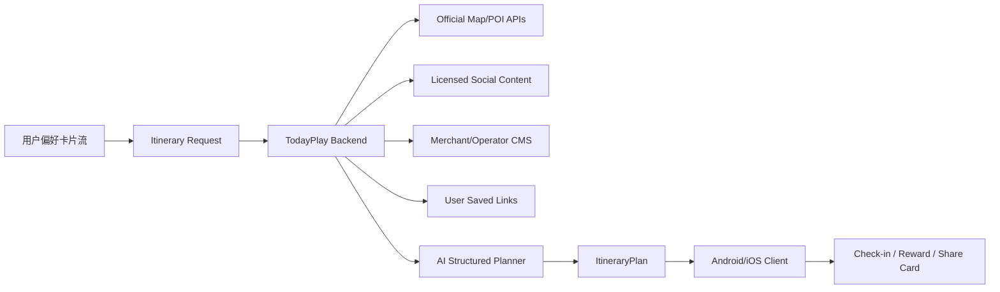

# 今天怎么玩 V0.8 正式线上基础版报告

生成时间：2026-06-08  
版本：`0.8.0` / `versionCode 8`  
Debug APK：`D:\AppStore\nemu\real\app\build\outputs\apk\debug\app-debug.apk`  
Release AAB：`D:\AppStore\nemu\real\app\build\outputs\bundle\release\app-release.aab`

## 1. 本轮目标

把「今天怎么玩 / Today's Private Quest」从深圳本地路线原型，推进为正式线上产品基础：全球经典和网红打卡点的信息整理规划 App。

新的产品定位是：

- 面向情侣、朋友、家人、亲子、多人出行和独自散心。
- 收集关系需求、城市、预算、时间、交通方式和偏好。
- 整理官方地图 POI、授权社交内容灵感、商家内容、用户收藏和运营内容。
- 输出一条可执行路线：地点、顺序、地图入口、拍照建议、消费建议、避坑提示、互动任务、打卡积分和通关卡。
- 商业化方向从单纯会员文案升级为 Plus 订阅、单次高级路线、全球城市包、拍照机位包、本地生活合作权益。

## 2. 本轮已交付

### 全球地点与路线结构

新增全球 POI 样例库：

- `D:\AppStore\nemu\real\app\src\main\java\com\todayplay\app\data\GlobalPoiMockData.kt`

覆盖样例城市：

- 深圳、上海、北京、成都、香港、东京、首尔、新加坡、曼谷、巴黎、伦敦、纽约、巴塞罗那、迪拜。

每个 POI 现在具备：

- 国家、城市、区域、地址、经纬度。
- 标签、适合关系、预算等级、停留时间。
- 图片占位、推荐理由、风险提示。
- 内容来源、数据新鲜度、正式版是否需要官方核验。
- 全球分类，如经典城市景观、网红拍照点、文化地标、商圈生活方式、Citywalk。

### 全球路线生成器

重写：

- `D:\AppStore\nemu\real\app\src\main\java\com\todayplay\app\generator\LocalItineraryGenerator.kt`

新逻辑：

1. 接收关系、城市/关键词、时间、预算、交通方式和偏好。
2. 合并为多人/双方需求。
3. 在全球 POI 目录里按城市、国家、名称和标签搜索。
4. 根据关系和偏好排序候选地点。
5. 根据时间长度选择 2-4 个站点。
6. 输出路线概览、每站任务、地图入口、拍照建议、消费建议、备用方案、拥挤风险、雨天备选和积分规则。

当前仍是本地样例搜索，不是全球全量数据库。正式版需要后端和授权数据源。

### 卡片流输入页

重做：

- `D:\AppStore\nemu\real\app\src\main\java\com\todayplay\app\ui\screens\CreateQuestScreen.kt`

用户不再看到一页堆满条件，而是一张张选择：

1. 和谁一起。
2. 去哪个城市。
3. 今天有多久。
4. 人均预算。
5. 交通方式。
6. 今天最想要什么。
7. 确认并生成。

大多数步骤选完自动进入下一张卡；偏好多选步骤允许最多选 4 个，再继续。这个流程更适合移动端浏览和小屏设备。

### 首页和快速入口全球化

修改：

- `D:\AppStore\nemu\real\app\src\main\java\com\todayplay\app\ui\screens\HomeScreen.kt`
- `D:\AppStore\nemu\real\app\src\main\java\com\todayplay\app\ui\screens\QuickStartScreen.kt`

变化：

- 首页不再写“深圳路线副本”，改为“全球路线副本”。
- 快速入口改为东京、上海、巴黎、首尔、新加坡等全球样例。
- 真正指定城市的入口放到卡片流。

### 结果页全球信息展示

修改：

- `D:\AppStore\nemu\real\app\src\main\java\com\todayplay\app\ui\screens\QuestResultScreen.kt`

变化：

- 路线概览显示候选地点数量。
- 每站显示国家、城市、区域。
- 每站显示来源与“正式版需官方数据核验”。
- 地图按钮从“打开高德导航”改成“打开地图”，适配全球路线。

### 付费接口

新增：

- `D:\AppStore\nemu\real\app\src\main\java\com\todayplay\app\model\BillingModels.kt`
- `D:\AppStore\nemu\real\app\src\main\java\com\todayplay\app\billing\PlayBillingGateway.kt`

已定义商品：

- `todayplay.plus.monthly`：Plus 月卡。
- `todayplay.itinerary.premium.once`：单次高级路线。
- `todayplay.citypack.global`：全球城市包。
- `todayplay.photo.positions`：拍照机位包。

已接入 Android 客户端支付流程：

1. App 启动后连接 Google Play Billing。
2. 查询 Play Console 商品详情。
3. 商店页点击商品后启动 Google Play 购买流程。
4. 购买返回后提示必须服务端验单再发放权益。

当前没有做假付费成功，也没有在客户端直接发放会员权益。

### 商店页升级

修改：

- `D:\AppStore\nemu\real\app\src\main\java\com\todayplay\app\ui\screens\ShopScreen.kt`

变化：

- 按钮文案从“测试付费意愿”改为“连接正式支付商品”。
- 明确 Google Play Billing 已接入客户端网关。
- 强调真实上架前需要 Play Console 商品、服务端验单、退款和权益发放。

## 3. 正式全球搜索的架构说明

客户端已经有全球 POI 和路线模型，但正式版本不能把全球内容抓取放在客户端。

推荐正式架构：

必须后端化的能力：

- 全球 POI 搜索。
- 官方地图路线规划。
- 营业时间、票价、距离、交通耗时、人流和天气。
- 小红书、抖音、TikTok、Instagram 等社交内容的合规授权解析。
- 商家合作、探店券、城市包和节日包。
- AI 结构化路线生成。
- 积分权益、反作弊和兑换。
- 订单验单、退款、订阅状态和权益发放。

## 4. 合规边界

本轮继续坚持：

- 不做非法爬虫。
- 不绕过第三方平台规则。
- 不在客户端抓取小红书、抖音、高德、美团、大众点评、Google Maps、Instagram、TikTok 等内容。
- 不展示未授权第三方图片。
- 不写 API Key。
- 不接真实后端。
- 不请求定位、相册、摄像头、人脸识别或通讯录权限。

本轮新增普通权限：

- `android.permission.INTERNET`：用于未来后端、地图和支付商品查询。

依赖/系统自动合并的普通权限：

- `com.android.vending.BILLING`：Google Play Billing。
- `android.permission.ACCESS_NETWORK_STATE`：由依赖合并，用于网络状态。
- `com.todayplay.app.DYNAMIC_RECEIVER_NOT_EXPORTED_PERMISSION`：AndroidX 自动生成保护权限。

`android:allowBackup="false"` 仍保持关闭。

## 5. Google Play / App Store 上架状态

### Android / Google Play

已生成：

- Debug APK：可本地试用。
- Release AAB：Google Play 上架格式基础产物。

还缺：

- 正式签名证书和 Play App Signing 配置。
- Play Console 应用创建。
- 商品 ID 创建并激活。
- 服务端验单接口。
- 隐私政策 URL。
- 数据安全表单。
- 应用截图、图标、分级、审核说明。
- Release 版本混淆、崩溃监控、日志收敛。
- Billing 版本策略确认：当前使用 `com.android.billingclient:billing:8.0.0` 以兼容本项目 Kotlin 2.0.21；Google 官方已有 9.0.0，正式上架前应评估升级 Kotlin/AGP 后切到最新 Billing。

### iOS / App Store

当前仓库是 Android Kotlin 项目，不能直接产出 iOS App Store 包。

要上 App Store，需要新增：

- iOS 工程，建议 SwiftUI。
- StoreKit 2 支付接口。
- App Store Connect 商品、订阅组和审核材料。
- iOS 地图跳转、权限说明和隐私清单。
- 与 Android 共用的后端 API Contract。

## 6. Mock 与真实能力边界

当前是真功能：

- 卡片流偏好输入。
- 全球样例 POI 搜索。
- 路线生成。
- 地图跳转。
- 本地打卡积分。
- 历史路线保存。
- 通关卡读取真实打卡状态。
- Google Play Billing 客户端接口。
- Release AAB 构建。

当前仍是 mock / 占位：

- 全球全量 POI。
- 网红打卡点热度。
- 社交平台推荐来源。
- 营业时间、票价、人流、天气。
- 商家券和积分兑换。
- AI 真实规划。
- 后端验单和权益发放。
- App Store StoreKit 接口。

## 7. 构建测试结果

已通过：

- `assembleDebug`：成功。
- `bundleRelease`：成功。
- `lintDebug`：成功，0 errors。

产物：

- `D:\AppStore\nemu\real\app\build\outputs\apk\debug\app-debug.apk`
- `D:\AppStore\nemu\real\app\build\outputs\bundle\release\app-release.aab`

APK 信息：

- Package：`com.todayplay.app`
- Version：`0.8.0`
- VersionCode：`8`
- minSdk：`26`
- targetSdk：`35`

Lint warning：

- Compose、Activity、Lifecycle 有新版本。
- Billing 有 9.0.0 新版本，但当前项目 Kotlin 版本不兼容。
- `allowBackup=false` 在 Android 12+ 建议补 `dataExtractionRules`。
- 启动图标缺少 monochrome 适配。
- `mipmap-anydpi-v26` 对 minSdk 26 来说可整理。

未完成：

- 未连接真机或模拟器做点击测试。
- 未做多屏截图回归。
- 未做真实 Play Console 商品查询测试。
- 未做 iOS 版本。

## 8. 下一轮正式开发建议

优先级 1：

- 建后端 API Contract：`/poi/search`、`/itinerary/generate`、`/billing/verify`、`/entitlements`、`/rewards`。
- 做服务端验单，不允许客户端直接发权益。
- 做 `RemotePoiProvider`，让客户端从 mock 切到正式后端。
- 做 Play Console 测试商品和内部测试轨道。

优先级 2：

- 升级 Kotlin/AGP/Compose/Billing 到官方最新兼容组合。
- 增加 `dataExtractionRules`、monochrome 图标、release 混淆和崩溃监控。
- 做正式隐私政策、数据安全表单和商店文案。

优先级 3：

- 启动 iOS SwiftUI 工程。
- StoreKit 2 接口。
- Android/iOS 共享后端路线模型。
- 全球城市包运营后台。

## 9. 官方依据

- Google Play Billing 集成文档：https://developer.android.com/google/play/billing/integrate
- Android App Bundle 文档：https://developer.android.com/guide/app-bundle
- Apple StoreKit 文档：https://developer.apple.com/storekit/
- App Store Review Guidelines：https://developer.apple.com/app-store/review/guidelines/
