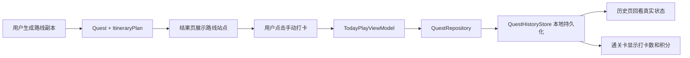

# 今天怎么玩 V0.7-TravelPivot 更新报告

生成时间：2026-06-08  
APK：`D:\AppStore\nemu\real\app\build\outputs\apk\debug\app-debug.apk`  
版本：`versionCode 7` / `versionName 0.7.0`

## 1. 修改摘要

本轮把「今天怎么玩 / Today's Private Quest」从本地文字副本生成器，升级为“社交内容灵感 + 关系需求匹配 + 本地路线规划 + 地图跳转 + 打卡积分”的旅游出行 App 2.0 原型。

V0.7 仍然不接真实爬虫、不接真实 AI、不接真实支付、不接后端、不新增敏感权限。当前重点是先把产品骨架做出来：用户选择关系、人群、城市、时间、预算、交通和偏好后，App 基于本地深圳精选 POI mock 库生成一条路线副本，用户可以查看每一站、打开高德地图、手动打卡、获得积分、生成通关卡，并在历史页回看真实路线状态。

## 2. 文件清单

新增文件：

- `D:\AppStore\nemu\real\app\src\main\java\com\todayplay\app\model\TravelModels.kt`
- `D:\AppStore\nemu\real\app\src\main\java\com\todayplay\app\data\ShenzhenPoiMockData.kt`
- `D:\AppStore\nemu\real\app\src\main\java\com\todayplay\app\generator\LocalItineraryGenerator.kt`
- `D:\AppStore\nemu\real\app\src\main\java\com\todayplay\app\navigation\MapNavigator.kt`
- `D:\AppStore\nemu\real\UPDATE_REPORT_V0_7_TRAVEL_PIVOT.md`

主要修改文件：

- `D:\AppStore\nemu\real\app\src\main\java\com\todayplay\app\model\QuestModels.kt`
- `D:\AppStore\nemu\real\app\src\main\java\com\todayplay\app\generator\LocalQuestGenerator.kt`
- `D:\AppStore\nemu\real\app\src\main\java\com\todayplay\app\data\QuestHistoryStore.kt`
- `D:\AppStore\nemu\real\app\src\main\java\com\todayplay\app\data\QuestRepository.kt`
- `D:\AppStore\nemu\real\app\src\main\java\com\todayplay\app\ui\screens\HomeScreen.kt`
- `D:\AppStore\nemu\real\app\src\main\java\com\todayplay\app\ui\screens\CreateQuestScreen.kt`
- `D:\AppStore\nemu\real\app\src\main\java\com\todayplay\app\ui\screens\QuickStartScreen.kt`
- `D:\AppStore\nemu\real\app\src\main\java\com\todayplay\app\ui\screens\QuestResultScreen.kt`
- `D:\AppStore\nemu\real\app\src\main\java\com\todayplay\app\ui\screens\ShareCardScreen.kt`
- `D:\AppStore\nemu\real\app\src\main\java\com\todayplay\app\ui\screens\HistoryScreen.kt`
- `D:\AppStore\nemu\real\app\src\main\java\com\todayplay\app\ui\components\TodayPlayComponents.kt`
- `D:\AppStore\nemu\real\app\src\main\java\com\todayplay\app\ui\screens\ShopScreen.kt`
- `D:\AppStore\nemu\real\app\build.gradle.kts`

## 3. 新模型说明

本轮新增 Travel 模型层，把原来的 Quest 扩展为路线副本：

- `UserPreference`：单个用户的出行偏好，如关系身份、预算、时间、交通方式、拍照/吃饭/散步/探店等偏好。
- `GroupPreference`：多人偏好合并结果，用于表达情侣、朋友、家人或多人出行的共同需求。
- `POI`：本地地点数据，包含名称、城市、区域、地址、经纬度、标签、适合关系类型、预算、预计停留时间、图片占位、推荐理由、内容来源和风险提示。
- `RouteStop`：路线中的每一站，包含顺序、地点、开始时间、停留时间、打卡任务、拍照建议、消费建议、备用方案和地图导航动作。
- `ItineraryPlan`：完整路线方案，包含半日游、一日游、下班后 90 分钟、周末情侣局、朋友 Citywalk、亲子家庭局等路线类型。
- `CheckInTask`：地点打卡任务，用于把路线从“看推荐”变成“可执行任务”。
- `RewardPoint`：本地积分记录，用于记录用户完成打卡后的奖励。
- `ExternalMapAction`：地图跳转动作，封装高德 App URI、浏览器 fallback URI 和复制地址兜底。
- `ContentSource` / `SourcePolicy` / `ContentComplianceNote`：合规来源说明，明确本轮数据为本地 mock 和人工精选占位。

原有模型也做了扩展：

- `QuestInput` 增加 `transportMode`。
- `Quest` 增加 `itineraryPlan`。
- `QuestProgress` 增加本地积分和照片预览 URI 状态。
- `CompletionCardData` 增加真实地点打卡数、总站点数、总积分和路线类型。

## 4. 路线生成逻辑

`LocalItineraryGenerator` 是当前路线生成核心。它不调用 AI，也不访问网络。

生成流程：

1. 读取用户输入的关系、城市、时间、预算、交通方式、氛围和偏好。
2. 转换为 `GroupPreference`，形成多人共同需求。
3. 从 `ShenzhenPoiMockData` 中筛选适合当前关系类型和偏好的深圳 POI。
4. 根据路线类型选择 2-3 个站点，例如：
   - 下班后 90 分钟情侣路线
   - 周末情侣局
   - 朋友 Citywalk
   - 亲子家庭局
   - 低预算轻松路线
5. 给每个站点生成 `RouteStop`、`CheckInTask`、拍照建议、消费建议、备用方案、避坑提示和地图跳转动作。
6. 汇总预计花费、拥挤风险、雨天备选、最佳拍照时间和积分规则。
7. 将路线挂到 `Quest.itineraryPlan`，继续复用原来的任务、通关卡、历史和会员入口。

## 5. 地图跳转方式

新增 `MapNavigator.openInAmap(context, action)`。

当前行为：

- 优先通过 Android Intent 打开高德地图 App。
- 如果设备未安装高德地图，则打开高德浏览器地图链接。
- 如果浏览器也无法打开，则复制地点地址，并用 Toast 提醒用户。

当前不做：

- 不读取用户定位。
- 不请求定位权限。
- 不做强制到店校验。
- 不上传用户行程轨迹。

## 6. 打卡积分数据流

数据流如下：

当前积分规则：

- 每个路线站点都有一个 `CheckInTask`。
- 用户手动完成站点打卡后，本地生成一条 `RewardPoint`。
- 取消完成或跳过任务时，会同步移除对应积分。
- 通关卡读取真实完成站点数和总积分，不再写死。
- 历史页显示路线类型、地点打卡进度和积分。

照片上传当前是 mock / 本地预览概念，不上传服务器，不做人脸识别，不做隐私照片处理。

## 7. 隐私与合规处理

本轮明确收紧了外部内容和隐私边界：

- 不抓取小红书、抖音、美团、高德或其他第三方平台内容。
- 不绕过任何平台规则。
- 不在客户端写 API Key。
- 不展示未经授权的第三方真实图片。
- 不伪造“真实热度”“真实推荐来源”。
- 不新增敏感权限。
- 不请求定位、相册、摄像头或通讯录权限。
- `AndroidManifest.xml` 继续保持 `android:allowBackup="false"`，降低正式版用户数据被系统备份带走的风险。
- `ProductEventLogger` 不记录用户 note、任务全文或对话全文，避免把私密偏好和互动内容写入日志。

新增的 `SourcePolicy` 和 `ContentComplianceNote` 用于在代码结构中固定合规原则：真实外部内容只能来自官方开放 API、用户授权分享链接、商家合作、运营后台或后端合规聚合服务。

## 8. 当前 Mock 数据

以下内容当前均为 mock 或本地人工精选占位：

- 深圳 POI 地点库。
- “社交平台灵感”“网红打卡”“内容来源”等字段。
- 地点图片占位。
- 拥挤风险。
- 推荐理由。
- 雨天备选。
- 最佳拍照时间。
- 积分权益。
- 照片上传和照片预览。
- 会员权益和本地生活交易权益。

这些 mock 数据的作用是验证产品闭环和数据结构，不代表真实平台数据或真实商家合作。

## 9. 需要后端或官方 API 才能实现的能力

下一阶段如果要做成真实旅游出行产品，需要后端或合规外部接口支持：

- 官方地图 POI 检索、路线规划、实时导航和距离计算。
- 高德地图、腾讯地图或其他地图服务的正式 API 接入。
- 用户手动粘贴小红书/抖音/大众点评/美团分享链接后的合规解析。
- 商家合作地点库、探店券、套餐券和佣金结算。
- 运营后台维护城市包、节日路线包、热门地点和避坑提示。
- AI 根据多人偏好生成结构化 `ItineraryPlan`。
- 真实拥挤度、天气、营业时间、排队风险和价格区间。
- 积分账户、权益兑换和反作弊。
- 照片上传、内容审核和隐私授权。
- 真实支付、订阅、退款和发票流程。

## 10. 商业化方向

V0.7 已把商业化从“会员副本”升级为“本地生活交易 + 高级规划”：

免费用户：

- 每天生成基础路线。
- 查看基础地点卡。
- 手动打卡并获得本地积分。
- 保存历史路线和基础通关卡。

高级用户可规划为：

- 多候选路线。
- 低拥挤路线。
- 雨天备选。
- 拍照机位和姿势模板。
- 纪念日路线。
- 多人偏好平衡。
- 高清通关卡。
- 积分兑换权益。
- 城市路线包、节日路线包和商家合作券。

未来收入结构：

- 会员订阅。
- 城市包 / 节日包 / 拍照模板包。
- 本地商家合作和探店券。
- 出行路线内容运营。
- 到店转化和本地生活分佣。

## 11. 编译测试结果

已完成：

- Debug APK 构建通过。
- Android Lint Debug 检查通过。
- APK 已生成。
- 版本号已更新到 `0.7.0`。
- 未新增源码中的敏感权限。

APK 文件：

- 路径：`D:\AppStore\nemu\real\app\build\outputs\apk\debug\app-debug.apk`
- 大小：约 15.1 MB
- 生成时间：2026-06-08 11:36:04

未完成：

- 当前没有可用真机或模拟器连接，因此未做真机点击测试。
- 未做真实地图 App 安装场景测试。
- 未做不同屏幕尺寸的完整截图回归。

## 12. 下一轮建议

建议 V0.8 做“真实出行体验增强版”：

1. 做更完整的城市路线信息架构：路线列表、多候选路线、地点详情页、地图预览页。
2. 加入屏幕适配回归：小屏、横屏、折叠屏、平板。
3. 加入路线生成质量评分：是否省时、是否顺路、是否符合预算、是否适合关系类型。
4. 加入用户收藏和“想去清单”，让内容密度从一次生成变成长期积累。
5. 做合规分享链接输入原型：用户粘贴分享链接，App 只保存用户主动提供的链接和摘要，不做客户端爬虫。
6. 接入后端前先定义正式 API Contract：POI、路线、内容来源、权益、积分、支付都要服务端化。
7. 做一轮真机测试和屏幕截图测试，优先修复结果页长内容、站点卡过密和地图跳转 fallback 的体验问题。
